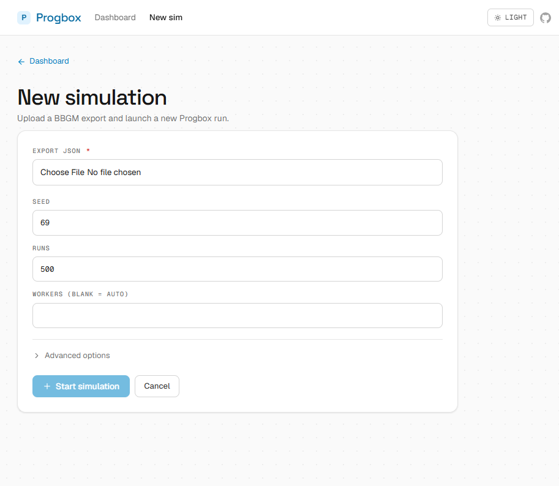

# progbox-ui

A clean UI + API for running [Progbox](https://github.com/akshayexists/progbox) Monte Carlo simulations. Upload exports, configure runs, and browse results — all from one interface.




## Quick Start

**Recommended: WSL (Ubuntu) or Linux.** This matches CI and is the least surprising way to build the C++ engine.

```bash
# From repo root. Interactive by default; add --yes for non-interactive installs.
pnpm run setup:wsl

pnpm dev
```

**Native Windows** is supported from PowerShell:

```powershell
pnpm run setup:windows

pnpm dev
```

The setup scripts install workspace dependencies, optionally build the vendored C++ engine, and run `pnpm doctor`. Terminal output is intentionally condensed; full logs are written to `logs/setup-wsl-*.log` or `logs/setup-windows-*.log`. For prerequisite-only checks, use `bash scripts/setup-wsl.sh --preflight-only` or `.\scripts\setup-windows.ps1 -PreflightOnly`.

| Service | URL |
| --- | --- |
| Web UI | http://localhost:5173 |
| API | http://127.0.0.1:8000 (e.g. `GET /api/config`) |

## Requirements

| Runtime | WSL/Linux | Native Windows |
| --- | --- | --- |
| Node.js | 22+ preferred; setup can install NodeSource 22.x with approval | 22+ preferred; setup can offer `winget` install |
| pnpm | `10.8.0` via Corepack/packageManager | `10.8.0` via Corepack/packageManager |
| C++ toolchain | CMake + `build-essential`/`g++` | CMake + Visual Studio Build Tools with Desktop development with C++ |
| Storage/services | No database, cache, or broker; file-backed under `outputs/` | Same |

If you want to install prerequisites manually first:

```bash
# WSL Ubuntu / Linux
sudo apt update
sudo apt install -y git curl ca-certificates cmake build-essential
```

```powershell
# Windows PowerShell examples
winget install --id OpenJS.NodeJS.LTS -e
winget install --id Kitware.CMake -e
winget install --id Microsoft.VisualStudio.2022.BuildTools -e --override "--wait --passive --add Microsoft.VisualStudio.Workload.VCTools --includeRecommended"
```

## Manual Setup

Use these steps if you do not want the setup scripts to install or repair anything.

```bash
# WSL/Linux
corepack enable
corepack prepare pnpm@10.8.0 --activate
pnpm install
pnpm build:engine
pnpm dev
```

```powershell
# Native Windows
corepack enable
corepack prepare pnpm@10.8.0 --activate
pnpm install
pnpm build:engine
pnpm dev
```

After `pnpm build:engine`, the API discovers the binary under `api/vendor/progbox_cpp/build/` (for example `progbox`, `progbox.exe`, `Release/progbox.exe`, or `x64/Release/progbox.exe`). Override with `PROGBOX_CPP_BINARY` if you build elsewhere.

## Project Structure

```
web/                        Vue 3 + Vite + Tailwind v4 frontend
api/                        TypeScript Fastify API (`src/`)
api/vendor/progbox_cpp/     Vendored C++ Progbox engine source
data/                       Default export.json for local runs
outputs/                    Simulation run storage (gitignored)
e2e/                        Playwright browser tests & fixtures
```

## Commands

### First-time setup

| Environment | Commands |
| --- | --- |
| WSL / Linux | `pnpm run setup:wsl` |
| Windows (PowerShell) | `pnpm run setup:windows` |

### Daily dev — always use `pnpm dev`

`pnpm dev` starts **both** the web UI and API together. Never run one without the other.

```bash
# WSL / Linux
pnpm dev
```

```powershell
# Windows
pnpm dev
```

Web UI → http://localhost:5173 | API → http://127.0.0.1:8000

### When something changes

| Situation | Command |
| --- | --- |
| C++ engine source changed | `pnpm build:engine` |
| Node/JS deps changed (`pnpm-lock.yaml`) | `pnpm install` |
| Full rebuild / repair from scratch | `pnpm run setup:wsl` (WSL) or `pnpm run setup:windows` (Win) |

### Advanced (partial starts)

> These leave you with a broken environment — use only for debugging individual services.

| Command | What it does |
| --- | --- |
| `pnpm dev:api-only` | API only — web UI will have no backend |
| `pnpm dev:web-only` | Web only — all API calls will fail |

### CI / quality

| Command                | Purpose                                             |
| ---------------------- | --------------------------------------------------- |
| `pnpm check`           | Lint, typecheck, build, and API `tsc --noEmit`      |
| `pnpm test`            | Fast unit tests — Vitest (web + api)                |
| `pnpm test:api:engine` | Vendored-engine smoke test                          |
| `pnpm test:e2e`        | Playwright smoke suite                              |
| `pnpm test:e2e:full`   | Full seeded Playwright suite                        |
| `pnpm verify`          | All checks + unit tests + engine smoke + e2e smoke  |
| `pnpm verify:full`     | Same as verify, but with full e2e suite             |

> **Note:** Install Chromium once before running browser tests: `npx playwright install chromium`

## Common Setup Fixes

| Symptom | Fix |
| --- | --- |
| `pnpm` is missing or the wrong version | Run `corepack enable && corepack prepare pnpm@10.8.0 --activate`, or rerun the setup script. |
| Vite/Vitest cannot find a native binding after switching Windows/WSL | Rerun the matching setup script; it validates Vite's native dependency load and uses a forced frozen pnpm install only when repair is needed. |
| Native Windows C++ build cannot find a compiler | Install Visual Studio Build Tools with the Desktop development with C++ workload, then reopen PowerShell. |
| CMake reports a source/build directory mismatch | Rerun `pnpm build:engine`; `api/scripts/build-engine.mjs` clears stale CMake cache when Windows and WSL paths disagree. |
| Playwright times out waiting for `127.0.0.1:5173` | Stop `pnpm dev` before `pnpm test:e2e`; Playwright starts its own web/API servers. |

## Engine Integration

The active simulation backend is the vendored C++ engine source at `api/vendor/progbox_cpp/`. Build it once with `pnpm build:engine` before running simulations; the API looks for the generated binary under `api/vendor/progbox_cpp/build/`.

> **CMake cache mismatch:** When the same repo is accessed from both Windows (`M:/...`) and WSL (`/mnt/m/...`), CMake's `CMakeCache.txt` can contain an absolute path from the other environment. `api/scripts/build-engine.mjs` now detects this automatically and clears the `build/` directory before reconfiguring — no manual `rm -rf` needed.

The API runner orchestrates three stages:

1. **Clean** — TypeScript export cleaner (`api/src/services/exportCleaner.ts`) validates the uploaded export and writes `input.csv` for the engine
2. **Simulate** — the C++ `progbox` binary runs the Monte Carlo simulation
3. **Analyze** — TypeScript (`api/src/services/analysisGenerate.ts`) writes `analysis.xlsx` and `analysis_dashboard.html` from `raw/outputs.csv`

Static engine config for the UI is mirrored in [`api/src/services/engineAdapter.ts`](api/src/services/engineAdapter.ts).

### `teaminfo.json` is auto-generated

The cleaner needs a `{tid → abbrev}` map to resolve player team membership. Rather than require users to hand-maintain a `teaminfo.json`, the API derives it from each upload's `teams` array ([`api/src/services/teaminfo.ts`](api/src/services/teaminfo.ts)): active teams are mapped `tid → ABBREV` (uppercased), and the three BBGM game-rule slots (`-1 FA`, `-2 UDFA`, `-3 Retired`) are always appended. Users may still upload a custom `teaminfo.json` to override abbreviations for custom or historical leagues — when they do, the run's `metadata.json` records `teaminfo_source: "user"` instead of `"generated"`.

<details>
<summary><strong>Updating the engine</strong></summary>

Drop updated C++ engine source files into `api/vendor/progbox_cpp/`, then run `pnpm build:engine`. The UI will keep working as long as the engine binary accepts the adapter's arguments and writes outputs to the same paths:

- `raw/outputs.csv`
- `raw/godprogs.json`
- `analysis.xlsx`
- `analysis_dashboard.html`
- optional `engine_metadata.json`
Run `pnpm verify` after updating to validate the integration.
</details>

## API Overview

| Method | Endpoint                        | Description                         |
| ------ | ------------------------------- | ----------------------------------- |
| POST   | `/api/sims`                     | Upload export + config, start a run |
| GET    | `/api/sims`                     | List all runs                       |
| GET    | `/api/sims/{build}`             | Run metadata                        |
| GET    | `/api/sims/{build}/progress`    | SSE progress stream                 |
| GET    | `/api/sims/{build}/analysis`    | Analysis dashboard HTML             |
| GET    | `/api/sims/{build}/charts`      | List chart PNG filenames (legacy runs may have `charts/*.png`; C++ pipeline often uses the HTML dashboard instead) |
| GET    | `/api/sims/{build}/charts/{name}`| Serve chart PNG                    |
| GET    | `/api/sims/{build}/players`     | Player table                        |
| GET    | `/api/sims/{build}/godprogs`    | God-prog events                     |
| GET    | `/api/sims/{build}/download`    | Download analysis or CSV            |
| DELETE | `/api/sims/{build}`             | Delete a run                        |
| GET    | `/api/config`                   | Engine config snapshot              |

Build IDs follow **CalVer** format: `YYYYMMDDHHmmss`.

## Configuration

| Variable              | Purpose                        |
| --------------------- | ------------------------------ |
| `PROGBOX_OUTPUTS_DIR` | Custom simulation output path  |
| `VITE_API_BASE_URL`   | Override API base URL           |
| `PROGBOX_CPP_BINARY`  | Absolute path to a pre-built `progbox` / `progbox.exe` |

## Further Reading

- [TESTING.md](TESTING.md) — Test layers, fixtures, and conventions
