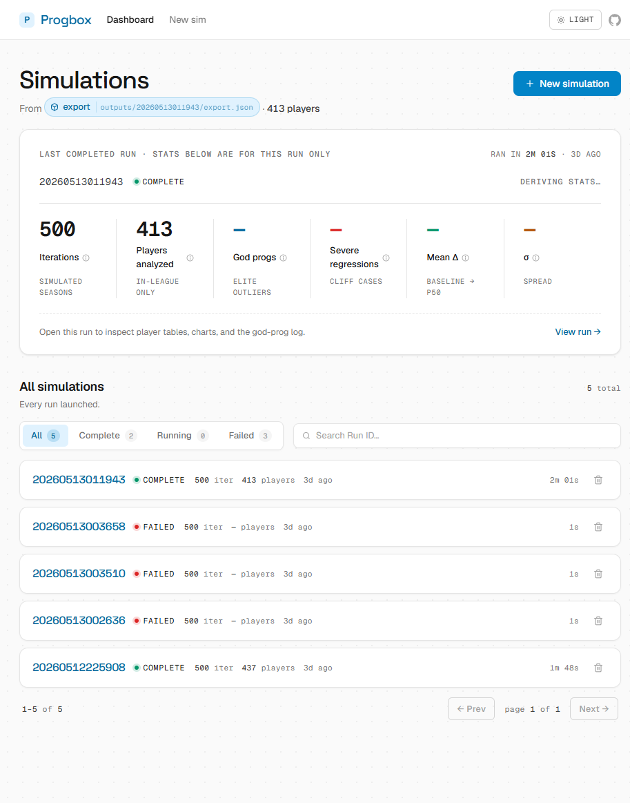

# progbox-ui

A clean UI + API for running [Progbox](https://github.com/akshayexists/progbox) Monte Carlo simulations. Upload exports, configure runs, and browse results — all from one interface.



## Quick Start

```bash
pnpm install
python -m venv .venv && source .venv/bin/activate   # Windows: .venv\Scripts\activate
pip install -r api/requirements.txt
pnpm dev
```

| Service  | URL                            |
| -------- | ------------------------------ |
| Web UI   | http://localhost:5173          |
| API Docs | http://127.0.0.1:8000/docs    |

## Project Structure

```
web/                        Vue 3 + Vite + Tailwind v4 frontend
api/                        FastAPI backend (routes, services, models)
api/vendor/progbox_v41/     Vendored Progbox v4.1 engine
data/                       Default export.json for local runs
outputs/                    Simulation run storage (gitignored)
e2e/                        Playwright browser tests & fixtures
```

## Commands

| Command                | Purpose                                             |
| ---------------------- | --------------------------------------------------- |
| `pnpm dev`             | Start web + API dev servers                         |
| `pnpm check`           | Lint, typecheck, build, and compile-check           |
| `pnpm test`            | Fast unit tests — Vitest + pytest                   |
| `pnpm test:api:engine` | Vendored-engine smoke test                          |
| `pnpm test:e2e`        | Playwright smoke suite                              |
| `pnpm test:e2e:full`   | Full seeded Playwright suite                        |
| `pnpm verify`          | All checks + unit tests + engine smoke + e2e smoke  |
| `pnpm verify:full`     | Same as verify, but with full e2e suite             |

> **Note:** Install Chromium once before running browser tests: `npx playwright install chromium`

## Engine Integration

The **Progbox v4.1** engine is vendored at `api/vendor/progbox_v41/`. The API runner orchestrates three stages:

1. **Clean** — `exportcleaner` validates the uploaded export
2. **Simulate** — `runsim.PROGEMUP()` runs the Monte Carlo simulation
3. **Analyze** — `analysis.generate_analysis()` produces charts and reports

All engine imports go through `api/services/engine_adapter.py`.

### `teaminfo.json` is auto-generated

`exportcleaner` needs a `{tid → abbrev}` map to resolve player team membership. Rather than require users to hand-maintain a `teaminfo.json`, the API derives it from each upload's `teams` array ([`api/services/teaminfo.py`](api/services/teaminfo.py)): active teams are mapped `tid → ABBREV` (uppercased), and the three BBGM game-rule slots (`-1 FA`, `-2 UDFA`, `-3 Retired`) are always appended. Users may still upload a custom `teaminfo.json` to override abbreviations for custom or historical leagues — when they do, the run's `metadata.json` records `teaminfo_source: "user"` instead of `"generated"`.

<details>
<summary><strong>Updating the engine</strong></summary>

Drop updated files into `api/vendor/progbox_v41/` — the UI will keep working as long as the engine exposes:

- `exportcleaner.exportcleaner(export_file, teams, teaminfo_file)`
- `runsim_cls(seed=seed).PROGEMUP(data, runs, output_dir, n_workers)`
- `analysis.generate_analysis(output_dir)`
- `progutils.Config`

…and writes outputs to the same paths (`raw/*.csv`, `charts/*.png`, `analysis.xlsx`, `raw/godprogs.json`).

Run `pnpm verify` after updating to validate the integration.
</details>

## API Overview

| Method | Endpoint                        | Description                         |
| ------ | ------------------------------- | ----------------------------------- |
| POST   | `/api/sims`                     | Upload export + config, start a run |
| GET    | `/api/sims`                     | List all runs                       |
| GET    | `/api/sims/{build}`             | Run metadata                        |
| GET    | `/api/sims/{build}/progress`    | SSE progress stream                 |
| GET    | `/api/sims/{build}/charts`      | List chart filenames                |
| GET    | `/api/sims/{build}/charts/{name}`| Serve chart PNG                    |
| GET    | `/api/sims/{build}/players`     | Player table                        |
| GET    | `/api/sims/{build}/godprogs`    | God-prog events                     |
| GET    | `/api/sims/{build}/download`    | Download analysis or CSV            |
| DELETE | `/api/sims/{build}`             | Delete a run                        |
| GET    | `/api/config`                   | Engine config snapshot              |

Build IDs follow **CalVer** format: `YYYYMMDDHHmmss`.

## Configuration

| Variable              | Purpose                        |
| --------------------- | ------------------------------ |
| `PROGBOX_OUTPUTS_DIR` | Custom simulation output path  |
| `VITE_API_BASE_URL`   | Override API base URL           |

## Further Reading

- [TESTING.md](TESTING.md) — Test layers, fixtures, and conventions
